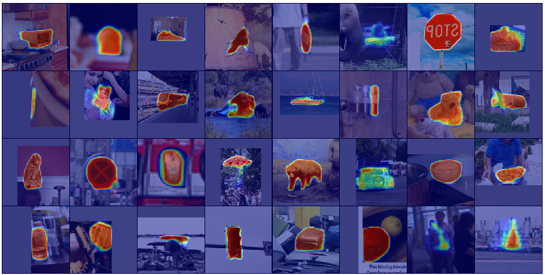
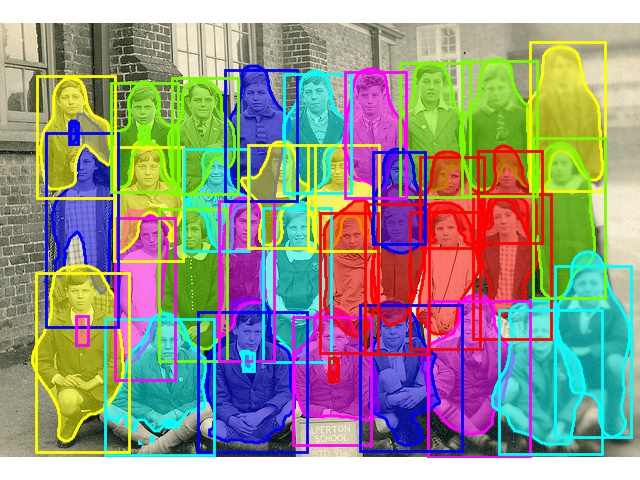
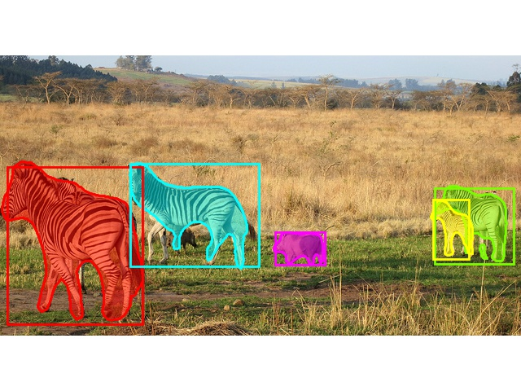
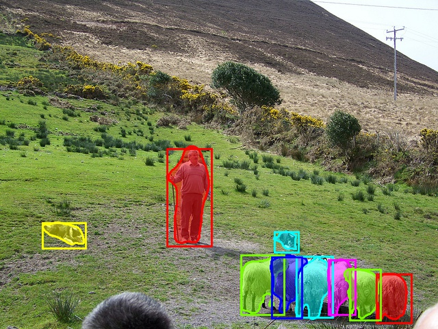
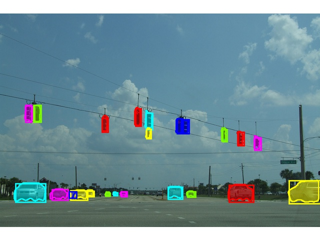
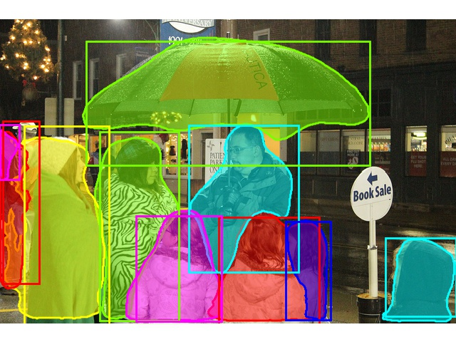
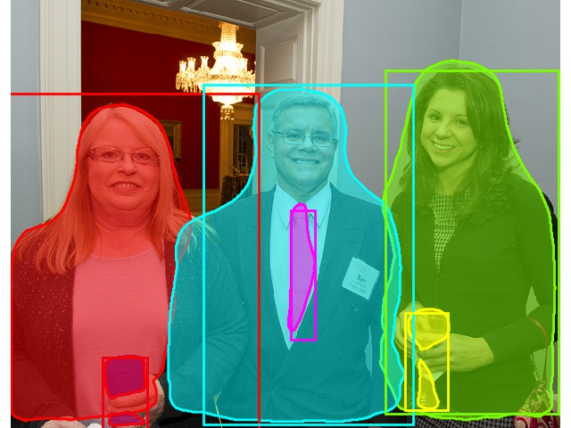
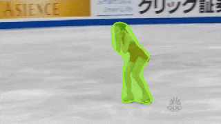

# deepmask-pytorch

This repository contains a PyTorch re-implementation for the DeepMask and SharpMask object proposal algorithms.

<div align="center">
  
</div>

## Requirements and Dependencies
* Linux
* NVIDIA GPU with compute capability 3.5+
* python3
* [PyTorch 0.4.1](https://pytorch.org/)

## Quick Start
To run pretrained DeepMask models to generate object proposals, follow these steps:

1. Clone this repository into $DEEPMASK:

   ```bash
   DEEPMASK=/desired/absolute/path/to/deepmask/ # set absolute path as desired
   git clone https://github.com/foolwood/deepmask-pytorch.git $DEEPMASK
   export PYTHONPATH=$DEEPMASK:$PYTHONPATH
   ```

2. Download pre-trained DeepMask models:

   ```bash
   mkdir -p $DEEPMASK/pretrained/deepmask; cd $DEEPMASK/pretrained/deepmask
   wget http://www.robots.ox.ac.uk/~qwang/DeepMask.pth.tar
   ```

3. Run `computeProposals.py` with a given model and optional target image (specified via the `-img` option):

   ```bash
   # apply to a default sample image (data/testImage.jpg)
   cd $DEEPMASK
   python tools/computeProposals.py --arch DeepMask --resume $DEEPMASK/pretrained/deepmask/DeepMask.pth.tar --img /path/to/image.jpg
   ```

## Training Your Own Model
To train your own DeepMask models, follow these steps:

### Preparation
1. If you have not done so already, clone this repository into $DEEPMASK:

   ```bash
   DEEPMASK=/desired/absolute/path/to/deepmask/ # set absolute path as desired
   git clone https://github.com/foolwood/deepmask-pytorch.git $DEEPMASK
   export PYTHONPATH=$DEEPMASK:$PYTHONPATH
   ```

2. Download and extract the [COCO](http://mscoco.org/) images and annotations:

   ```bash
   mkdir -p $DEEPMASK/data/coco; cd $DEEPMASK/data/coco
   wget http://images.cocodataset.org/zips/train2017.zip
   wget http://images.cocodataset.org/zips/val2017.zip
   wget http://images.cocodataset.org/annotations/annotations_trainval2017.zip

   unzip ./train2017.zip && unzip ./val2017.zip && unzip ./annotations_trainval2017.zip
   cd ../../loader/pycocotools && make && cd ../..
   ```

### Training
To train DeepMask, launch the `train.py` script. It contains several options, to list them, simply use the `--help` flag.

```bash
CUDA_VISIBLE_DEVICES=0,1,2,3 python tools/train.py --dataset coco -j 20 --freeze_bn
CUDA_VISIBLE_DEVICES=0,1,2,3 python tools/train.py --dataset coco -j 20 --arch SharpMask --freeze_bn
```

#### Testing
```bash
sh scripts/test_recall_coco.sh
```

## Naive Cascade Instance Segmentation (YOLOv3+DeepMask=10FPS~28FPS)

<div align="center">
  
  
  
  
  
  
</div>

```bash
git clone https://github.com/pjreddie/darknet.git
cd darknet
## Compile with CUDA  https://pjreddie.com/darknet/install/
cd $DEEPMASK
wget https://pjreddie.com/media/files/yolov3.weights
wget https://pjreddie.com/media/files/yolov3-tiny.weights
python tools/yolo_deepmask.py
```

## Naive Cascade Video Object Segmentation (DaSiamRPN+DeepMask=60FPS)

<div align="center">
  
</div>

```bash
git clone https://github.com/foolwood/DaSiamRPN.git
mkdir tracker && mv DaSiamRPN/code/* ./tracker/ && rm -rf ./DaSiamRPN
touch tracker/__init__.py
sed -i 's/utils/.utils/g' tracker/run_SiamRPN.py
cd $DEEPMASK
wget www.robots.ox.ac.uk/~qwang/SiamRPNVOT.model
python tools/dasiamrpn_deepmask.py
```


## Citations
Please consider citing this project in your publications if it helps your research. The following is a BibTeX reference. The BibTeX entry requires the `url` LaTeX package.
```
@misc{wang2018deepmask,
author = {Wang Qiang},
title = {{deepmask-pytorch}},
year = {2018},
howpublished = {\url{https://github.com/foolwood/deepmask_pytorch}}
}
```

## License

Licensed under an MIT license
